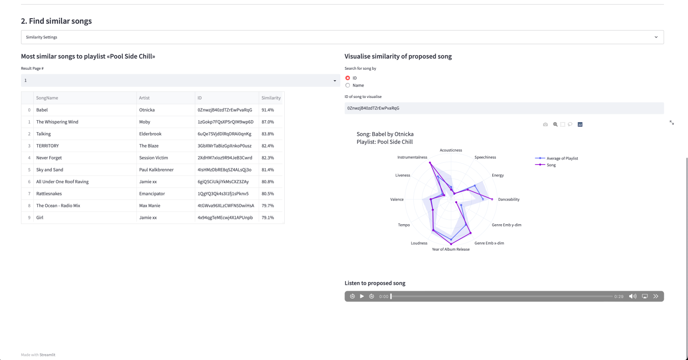

# Recommended Frequencies

# Introduction
«Recommended Frequencies» is a recommendation engine for playlists and currently works for Spotify.
Given a selected playlist in a user's library, 
the app suggests songs from the user's liked songs that may make a good addition to it.
The current goal of this app is to provide recommendations solely using information from a user's library.
Thus, methods like collaborative filtering are outside of the current scope.

Specifically, under the current scope, song suggestions are based on a trained Catboost model (for more information refer to [the model section](#model)) that uses
audio features, song attributes and genre information in the form of embeddings provided by [Every Noise at Once](https://everynoise.com/).
The audio features used by the app are a subset of those provided by [Spotify's API](https://developer.spotify.com/documentation/web-api/reference/#/operations/get-audio-features) 
in addition to the year of the song's album release. All features used are listed [here](#audio_features).

The app is developed using `streamlit`.

# Dashboard

The first step in the dashboard is to select a desired playlist from one's library.
A selection of songs, the playlist profile as measured by the audio features of its songs
and some album covers are visualised.


The second step is to select similarity metrics.
The first option is to simply base similarity off of audio features.
The second is to include genre information.
Details on the available similarity metrics can be found in [here](audio_features).



# Installation guide

## 1. Set up Spotify developer account & register app

These steps have been validated with the website's version as of 2021-01-17.

1. Go to https://developer.spotify.com/dashboard/ and create an account
2. Click on "CREATE AN APP"
3. Provide the app name & description of your choice, tick the terms of service and click "CREATE"
4. Click on "EDIT SETTINGS"
5. Under "Redirect URIs" put `http://localhost:9000/callback/` and `http://localhost:8090`
6. On the left side of the dashboard, underneath the description of your app, you will find your apps' "Client ID".
   Take note of it as you will need it in step 2.2.
7. Below your "Client ID" you will find an option to "SHOW CLIENT SECRET", click on it and take note of the value as you
   you will need it in step 2.2.

## 2. Set up the environment on your machine

### 2.1 Get the code & set environmental variables

The below instructions are for Linux or MacOS.

```commandline
git clone git@github.com:calyptis/RecommendedFrequencies.git
cd RecommendedFrequencies
source prepare_env.sh
```

### 2.2 Specify your credentials

In the folder `credentials` create a file named `credentials.json` 
where you specify the configurations you obtained in step 1.6 & 1.7.

The file has the following structure:

```python
{
	"client_id": "{your_client_id}",
	"client_secret": "{you_client_secret}",
	"redirect_uri": "http://localhost:9000/callback/",
	"redirect_flask_uri": "http://localhost:8090"
}
```

replace your client ID with value from step 1.6 and your client secret from step 1.7.

### 2.3 Obtain data

In order to host the dashboard locally, one must collect all relevant data.
This can be done by running

```commandline
python src/spotify/main.py
```

Note that this will open a Spotify login page in the browser were one must
authenticate themselves.

Once logged in, a `.spotify_caches` will be created in the root folder.

Subsequent API calls will not trigger a log-in page anymore unless this file is deleted.

### 2.4 Run the dashboard

Once all the data has been obtained, one can spin up the dashboard by running

```commandline
streamlit run src/streamlit/main.py
```

# User guide

## 1. Audio features<a name="audio_features"></a>

Documentation of all the available audio features can be found on
[Spotify's official documentation page](https://developer.spotify.com/documentation/web-api/reference/#/operations/get-audio-features).

In this project, a subset of those are used and are listed below with their official description for convenience:

1. **Acousticness**: A confidence measure from 0.0 to 1.0 of whether the track is acoustic. 1.0 represents high confidence the track is acoustic.
2. **Danceability**: Danceability describes how suitable a track is for dancing based on a combination of musical elements including tempo, rhythm stability, beat strength, and overall regularity. A value of 0.0 is least danceable and 1.0 is most danceable.
3. **Energy**: Energy is a measure from 0.0 to 1.0 and represents a perceptual measure of intensity and activity. Typically, energetic tracks feel fast, loud, and noisy. Perceptual features contributing to this attribute include dynamic range, perceived loudness, timbre, onset rate, and general entropy.
4. **Instrumentalness**: Predicts whether a track contains no vocals. "Ooh" and "aah" sounds are treated as instrumental in this context. The closer the instrumentalness value is to 1.0, the greater likelihood the track contains no vocal content. Values above 0.5 are intended to represent instrumental tracks, but confidence is higher as the value approaches 1.0.
5. **Liveness**: Detects the presence of an audience in the recording. Higher liveness values represent an increased probability that the track was performed live. A value above 0.8 provides strong likelihood that the track is live.
6. **Loudness**: The overall loudness of a track in decibels (dB). Loudness values are averaged across the entire track and are useful for comparing relative loudness of tracks. Loudness is the quality of a sound that is the primary psychological correlate of physical strength (amplitude). Values typically range between -60 and 0 db.
7. **Speechiness**: Speechiness detects the presence of spoken words in a track. The more exclusively speech-like the recording (e.g. talk show, audio book, poetry), the closer to 1.0 the attribute value. Values above 0.66 describe tracks that are probably made entirely of spoken words.
8. **Tempo**: The overall estimated tempo of a track in beats per minute (BPM). In musical terminology, tempo is the speed or pace of a given piece and derives directly from the average beat duration.
9. **Valence**: A measure from 0.0 to 1.0 describing the musical positiveness conveyed by a track. Tracks with high valence sound more positive (e.g. happy, cheerful, euphoric), while tracks with low valence sound more negative (e.g. sad, depressed, angry).

In addition, metadata on songs are considered. Specifically, the 10th audio attribute used in this project is **Year of Album Release**.

All these features are cast to a range of [0, 1] if they are not already.

## 2. [Model](#model)

To measure the similarity between two songs, a `Catboost` model is trained through contrastive learning.
Positive song pairs are generated based on their occurrence in the same playlist.
Negative song pairs are generated based on user specified pairs of playlists that are very different.

For each song pair, the model uses the audio features as well as their location in the genre space as measured by 
the Every Noise at Once project. Similar genres lie close to each other in this space, of which a visual representation is available on
the [project's website](https://everynoise.com).
Since this musical genre space is two-dimensional, each genre is represented by its `(x, y)` location in the scatter plot.

A song's location in this space is simply the average of all its associated genres.

# Known Bugs:
- All audio previews are sometimes played at the same time when updating the dashboard.

# TODO:
- Get the oldest year of release for a given song. 
  For example, if a song appeared in a recent remastered album, 
  track down the first album the song appears in and use that as a release date.

# Related projects
- https://dubolt.com
- https://newsroom.spotify.com/2021-09-09/get-perfect-song-recommendations-in-the-playlists-you-create-with-enhance/
- https://spotibot.com
- https://www.chosic.com/

# Resources:
- Spotify's song features
  - Sample of data: https://www.kaggle.com/nadintamer/top-tracks-of-2017
  - Description of features: https://developer.spotify.com/documentation/web-api/reference/#/operations/get-audio-features
- Analysis of music genres
  - Genre similarity: https://everynoise.com/
- Music recommendation
  - ML model: https://dl.acm.org/doi/10.1145/3383313.3412248
- Articles on Spotify's music recommendation
  - https://www.popsci.com/technology/spotify-audio-recommendation-research/
- Pre-trained ML models:
  - https://essentia.upf.edu/machine_learning.html
